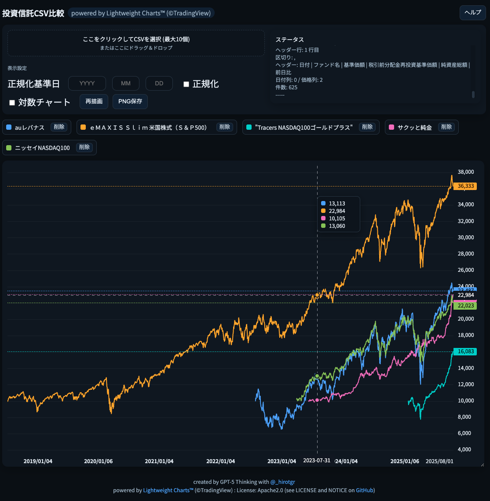
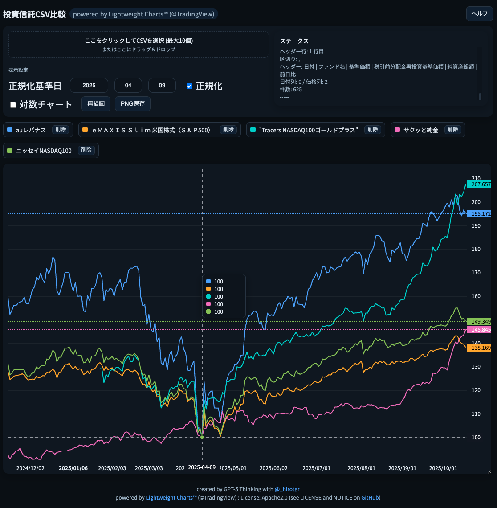

# ダウンロード

* [jfunds-nav-chart.zip](https://raw.githubusercontent.com/hirotgr/jfunds-nav-chart/main/jfunds-nav-chart.zip)

# これは何？

* 投資信託のパフォーマンス比較ツールです。
* ダブルクリック等で **jfunds-nav-chart.html** をブラウザで開き、投資信託運用会社のサイトからダウンロードしたCSVファイルをドラッグ＆ドロップすればチャートを表示できます。
* CSVファイルのファイル名は投信コードなどからファンド名に変更してください。CSVファイルの1行目に投資信託名が記載してある場合はファイル名の変更は不要です (例: 三菱UFJアセットマネジメント、大和アセットマネジメント)
* 複数の投資信託について、任意の日付の価額を100として正規化し、パフォーマンスを比較できます。◯◯ショックなどでの下落率比較には正規化基準日前のチャートが必要ですが、証券会社やYAHOOでは対応していません。
* オルカンとS&P500、三菱UFJと楽天のオルカンなど、似た投信のパフォーマンス比較を行えます。
* 凡例をクリックすることでチャートの表示・非表示を切り替えたり、投資信託データの削除を行えます。
* チャートの右下をつかんで動かせばチャートサイズを変更できます。
* 使い方はページ右上の **ヘルプ** ボタンを押して確認してください。
* 機能拡張などは基本的にするつもりはありません(気が向いたらやるかも)。

# 使用の前提

* Lightweight Charts™︎ (©TradingView) ライブラリ取得のために CDN `https://cdn.jsdelivr.net/` への接続性が必要です
* フォントライブラリ `https://fonts.googleapis.com` への接続性が必要です。
* 上記以外、外部への通信は行っていません。**心配な場合はウィルスチェックをしたり、ChatGPTやGeminiにフィアルを放り込んでコードの内容や安全性を質問してください。**

# 投資信託CSVデータの例

投資信託のCSVデータは運用会社の各ファンドのページからダウンロードできます。以下はその例です。サンプルを **sample-csv.zip** としてこのページに置いてあります。

* eMAXIS Slim 全世界株式: https://emaxis.am.mufg.jp/fund/253425.html (設定来データ)
* eMAXIS Slim S&P500: https://emaxis.am.mufg.jp/fund/253266.html (設定来データ)
* SBI VIT: https://apl.wealthadvisor.jp/webasp/sbi_am/pc/basic/chart/2021062901_chart.html (基準価額・純資産総額をダウンロード)
* ゴルプラ: https://www.amova-am.com/fund/detail/645066 (基準価額等ダウンロード)
* ゴルナス: https://www.amova-am.com/fund/detail/645133 (基準価額等ダウンロード)
* auレバナス: https://www.kddi-am.com/funds/4001/ (基準価額履歴CSVをダウンロードする)
* ニッセイNASDAQ100: https://www.nam.co.jp/fundinfo/nn100if/main.html (CSVデータダウンロード)
* 楽天オルカン: https://www.rakuten-toushin.co.jp/fund/nav/riracwi/ (基準価額のデータダウンロード)
* SBI サクッと純金: https://apl.wealthadvisor.jp/webasp/sbi_am/pc/basic/chart/202306080A_chart.html (基準価額・純資産総額をダウンロード)

投資信託の価額CSVは運用会社によってフォーマットが異なっています。ファンド名をご連絡いただければ、読み込めるよう対応します(気が向いた場合)。

## CSVファイルダウンロード自動化スクリプト

Pythonが少し分かる人は、このページにある `dlcsv.py` などを参考に、ChatGTPやGeminiにスクリプトを書いてもらってCSVファイル取得を自動化すると便利です。　\
必要な情報は以下です。

* CSVファイルのURL
* ダウンロードされるファイル名
* 名前変更後のファイル名 (`ファンド名.csv`)

Macユーザーでターミナル操作ができる方は、Pythonよりシェルスクリプト `dlcsv.sh` をカスタマイズする方が簡単かもしれません。

プログラムによるデータ自動取得はサイトの利用規約違反になる可能性がありますので、各サイトの利用規約を参照してください。

# ライセンスなど

* これはGPT-5 Thnkingがコーディングしたものです。hirotgr はほとんどコードを書いておらず、著作権を主張しません。自由に改変可能です。
* このアプリの使用によって何らかの損害が発生しても、hirotgr は責任を負いません。
* TradingViewがApache 2.0ライセンスで提供しているLightweight Charts™︎ (©TradingView) を使用しています。利用条件などはGitHubなどを参照してください。
  * https://jp.tradingview.com/lightweight-charts/
  * https://github.com/tradingview/lightweight-charts
* GoogleとAdobeが共同開発し、Googleから提供されている Noto Sans JP フォントを使用しています。ライセンスはSIL Open Font License 1.1です。詳しくは以下を参照してください。
  * https://developers.google.com/fonts/faq?hl=ja
  * https://fonts.google.com/

# 使用イメージ

基準価額の比較

2025/04/09のトランプ関税ショック底値を正規化基準日とした比較 (価額回復だけではなく、下落状況も参照可能)
